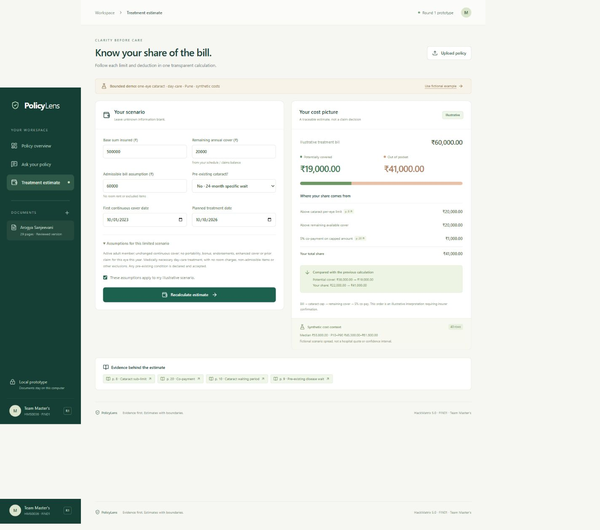
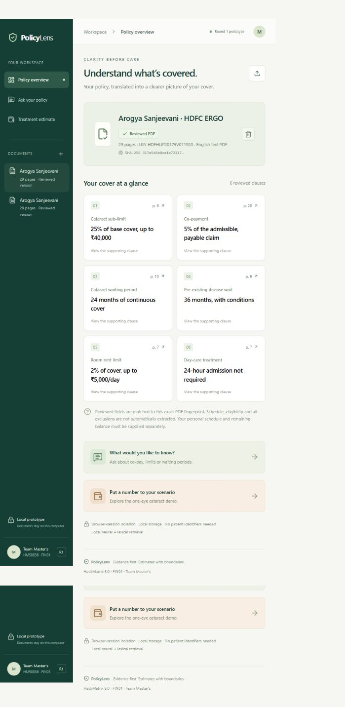

# Initial verification — 28 September 2026

Backend tests, dependency consistency, the real-model smoke trace, TypeScript and the production build were revalidated on **29 September 2026** after final formatting. The Windows one-command launcher started both services successfully. The browser evidence below is from the successful 28 September walkthrough; the browser tool blocked reopening localhost during the continuation, so a second visual walkthrough is not claimed.

## Results

- **41 unit/API regression cases passed** on Python 3.12, Windows. These cover waiting-period date boundaries, PED waits, sub-limits, exhausted/limited cover, half-up paise rounding, missing facts, invalid inputs, sub-paise precision, unsupported policies/cities, unsupported questions, PDF validation, cross-session isolation and deletion.
- **Dependency consistency:** `pip check` reported no broken requirements. The initial npm installation reported no known vulnerabilities.
- **Actual model + source smoke:** passed with `BAAI/bge-small-en-v1.5` in hybrid mode. All six excerpts occur on their cited source pages; four questions route to expected pages; the missing-balance and changed-balance calculations match expected amounts. See `demo-verification.json`.
- **Frontend:** TypeScript validation and Next.js production build passed.
- **Browser walkthrough:** demo import, actual file-chooser PDF upload, overview, page-8 source drawer, supported waiting-period question, unsupported remaining-balance question, missing-cover state, ₹38,000 initial estimate, stale-result marker, and ₹19,000 recalculation with a previous-result comparison were exercised in the browser.
- **Responsive checks:** inspected the desktop calculation layout and a 390-pixel mobile viewport; the mobile document did not overflow horizontally. Temporary viewport overrides were reset. No browser console errors were reported after the working flow.

The Python suite reported one upstream Starlette/AnyIO deprecation warning. It did not affect the passing results.

GitHub Actions is not enabled because the authenticated token does not have the `workflow` scope. The optional workflow is preserved as `ci-workflow.template.yml`; these results are local checks, not remote CI results.

## Screenshot evidence

These screenshots show the real local UI with the public wording and fictional inputs, not mockups.

The mobile screenshot is available at `screenshots/estimate-mobile.png`.

## What this does not establish

The regression cases are an initial correctness suite, not an independent domain benchmark, insurance certification, user study or price-prediction evaluation. The question-router thresholds have not been calibrated on a held-out set. There is no broad extraction accuracy claim. The estimate ordering still needs insurer/domain confirmation. No public deployment or Supabase account login flow was tested because those features are outside this build.

A narrated submission video is still a separate deliverable. The reproducible demo steps are in the README; the saved API trace records a programmatic end-to-end run.
